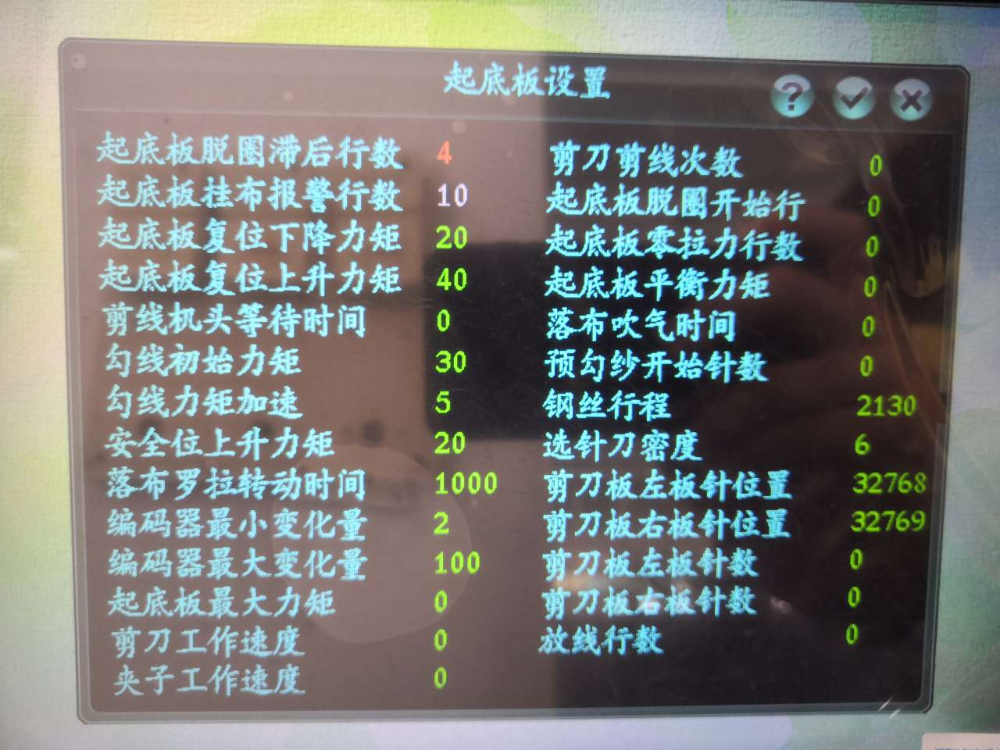

# 起底板设置

**触摸**：依次双击主菜单中的图标： &lt;参数设置&gt; - &gt; &lt;其他设置&gt; - &gt; &lt;起底板设置&gt; 进入 **\[起底板设置\]** 界面

**按键**：方向键移动光标，依次选中上述图标，按**\[Enter\]**键进入对应界面，按**\[Esc\]**键退出

### 起底板脱圈滞后行数

指起底板延迟脱圈的行数

**注**：复合针进行脱圈的行数=脱圈滞后行数+脱圈开始行所设定的值

**触摸**：双击图标右侧数值处，显示为红色，弹出小键盘，输入设定值，点击\[确定\]完成输入，点击\[退出\]退出小键盘。  
**按键**：方向键移动光标至图标右侧数值处，显示为红色，按**\[Enter\]**键弹出小键盘，输入设定值，按**\[Enter\]**键完成输入，按**\[Esc\]**键退出。

### 起底板挂布报警行数

设定起底板挂布时触发报警的行数，起底板挂布开始行到设定行范围内，系统不会触发报警提示

**注**：该数值已写死，无法修改

**触摸**：双击图标右侧数值处，显示为红色，弹出小键盘，输入设定值，点击\[确定\]完成输入，点击\[退出\]退出小键盘。  
**按键**：方向键移动光标至图标右侧数值处，显示为红色，按**\[Enter\]**键弹出小键盘，输入设定值，按**\[Enter\]**键完成输入，按**\[Esc\]**键退出。

### 起底板复位下降力矩

设定起底板在零位进行复位时，下降过程中能达到的最大力矩

**触摸**：双击图标右侧数值处，显示为红色，弹出小键盘，输入设定值，点击\[确定\]完成输入，点击\[退出\]退出小键盘。  
**按键**：方向键移动光标至图标右侧数值处，显示为红色，按**\[Enter\]**键弹出小键盘，输入设定值，按**\[Enter\]**键完成输入，按**\[Esc\]**键退出。

### 起底板复位上升力矩

设定起底板在零位进行复位时，上升过程中能达到的最大力矩

**触摸**：双击图标右侧数值处，显示为红色，弹出小键盘，输入设定值，点击\[确定\]完成输入，点击\[退出\]退出小键盘。  
**按键**：方向键移动光标至图标右侧数值处，显示为红色，按**\[Enter\]**键弹出小键盘，输入设定值，按**\[Enter\]**键完成输入，按**\[Esc\]**键退出。

### 剪线机头等待时间

机头纱出时有剪刀夹子动作时，设定机头等待工作的时间

**触摸**：双击图标右侧数值处，显示为红色，弹出小键盘，输入设定值，点击\[确定\]完成输入，点击\[退出\]退出小键盘。  
**按键**：方向键移动光标至图标右侧数值处，显示为红色，按**\[Enter\]**键弹出小键盘，输入设定值，按**\[Enter\]**键完成输入，按**\[Esc\]**键退出。

### 勾线初始力矩

设定起底板挂布时，从最高位到安全位的初始力矩

**触摸**：双击图标右侧数值处，显示为红色，弹出小键盘，输入设定值，点击\[确定\]完成输入，点击\[退出\]退出小键盘。  
**按键**：方向键移动光标至图标右侧数值处，显示为红色，按**\[Enter\]**键弹出小键盘，输入设定值，按**\[Enter\]**键完成输入，按**\[Esc\]**键退出。

### 勾线力矩加速

设定起底板挂布时，从最高位到安全位的加速度

**触摸**：双击图标右侧数值处，显示为红色，弹出小键盘，输入设定值，点击\[确定\]完成输入，点击\[退出\]退出小键盘。  
**按键**：方向键移动光标至图标右侧数值处，显示为红色，按**\[Enter\]**键弹出小键盘，输入设定值，按**\[Enter\]**键完成输入，按**\[Esc\]**键退出。

### 安全位上升力矩

设定起底板从安全位上升到最高位时的力矩

**触摸**：双击图标右侧数值处，显示为红色，弹出小键盘，输入设定值，点击\[确定\]完成输入，点击\[退出\]退出小键盘。  
**按键**：方向键移动光标至图标右侧数值处，显示为红色，按**\[Enter\]**键弹出小键盘，输入设定值，按**\[Enter\]**键完成输入，按**\[Esc\]**键退出。

### 落布罗拉转动时间

设定一片编织结束后， 落布时罗拉转动的时间（单位：毫秒）

**触摸**：双击图标右侧数值处，显示为红色，弹出小键盘，输入设定值，点击\[确定\]完成输入，点击\[退出\]退出小键盘。  
**按键**：方向键移动光标至图标右侧数值处，显示为红色，按**\[Enter\]**键弹出小键盘，输入设定值，按**\[Enter\]**键完成输入，按**\[Esc\]**键退出。

### 编码器最小变化量

设定编码器检测的最小值，若起底板工作过程中，系统检测到编码器的变化数值小于该设定值则报警

**触摸**：双击图标右侧数值处，显示为红色，弹出小键盘，输入设定值，点击\[确定\]完成输入，点击\[退出\]退出小键盘。  
**按键**：方向键移动光标至图标右侧数值处，显示为红色，按**\[Enter\]**键弹出小键盘，输入设定值，按**\[Enter\]**键完成输入，按**\[Esc\]**键退出。

### 编码器最大变化量

设定编码器检测的最大值，若起底板工作过程中，系统检测到编码器的变化数值大于该设定值则报警

**触摸**：双击图标右侧数值处，显示为红色，弹出小键盘，输入设定值，点击\[确定\]完成输入，点击\[退出\]退出小键盘。  
**按键**：方向键移动光标至图标右侧数值处，显示为红色，按**\[Enter\]**键弹出小键盘，输入设定值，按**\[Enter\]**键完成输入，按**\[Esc\]**键退出。

### 起底板最大力矩

设定起底板升降过程中允许达到的最大力矩

**触摸**：双击图标右侧数值处，显示为红色，弹出小键盘，输入设定值，点击\[确定\]完成输入，点击\[退出\]退出小键盘。  
**按键**：方向键移动光标至图标右侧数值处，显示为红色，按**\[Enter\]**键弹出小键盘，输入设定值，按**\[Enter\]**键完成输入，按**\[Esc\]**键退出。

### 剪刀工作速度

设定剪刀工作时的速度

**触摸**：双击图标右侧数值处，显示为红色，弹出小键盘，输入设定值，点击\[确定\]完成输入，点击\[退出\]退出小键盘。  
**按键**：方向键移动光标至图标右侧数值处，显示为红色，按**\[Enter\]**键弹出小键盘，输入设定值，按**\[Enter\]**键完成输入，按**\[Esc\]**键退出。

### 夹子工作速度

设定夹子工作时的速度

**触摸**：双击图标右侧数值处，显示为红色，弹出小键盘，输入设定值，点击\[确定\]完成输入，点击\[退出\]退出小键盘。  
**按键**：方向键移动光标至图标右侧数值处，显示为红色，按**\[Enter\]**键弹出小键盘，输入设定值，按**\[Enter\]**键完成输入，按**\[Esc\]**键退出。

### 剪刀剪线次数

设定剪刀工作时剪线的次数

**触摸**：双击图标右侧数值处，显示为红色，弹出小键盘，输入设定值，点击\[确定\]完成输入，点击\[退出\]退出小键盘。  
**按键**：方向键移动光标至图标右侧数值处，显示为红色，按**\[Enter\]**键弹出小键盘，输入设定值，按**\[Enter\]**键完成输入，按**\[Esc\]**键退出。

### 起底板脱圈开始行

设定起底板开始执行脱圈动作的行数

**触摸**：双击图标右侧数值处，显示为红色，弹出小键盘，输入设定值，点击\[确定\]完成输入，点击\[退出\]退出小键盘。  
**按键**：方向键移动光标至图标右侧数值处，显示为红色，按**\[Enter\]**键弹出小键盘，输入设定值，按**\[Enter\]**键完成输入，按**\[Esc\]**键退出。

### 起底板零拉力行数

零拉力行数所设值前的行数不进行拉力检测，从设定值开始进行拉力检测，连续两行起底板不动作时则产生起底板拉力失效报警

**注**：不包含空行和翻针行

**触摸**：双击图标右侧数值处，显示为红色，弹出小键盘，输入设定值，点击\[确定\]完成输入，点击\[退出\]退出小键盘。  
**按键**：方向键移动光标至图标右侧数值处，显示为红色，按**\[Enter\]**键弹出小键盘，输入设定值，按**\[Enter\]**键完成输入，按**\[Esc\]**键退出。

### 起底板平衡力矩

设定平衡起底板自身重力的力矩，可使起底板在安装或其他情况下取消刹车制动时不会快速下降

**触摸**：双击图标右侧数值处，显示为红色，弹出小键盘，输入设定值，点击\[确定\]完成输入，点击\[退出\]退出小键盘。  
**按键**：方向键移动光标至图标右侧数值处，显示为红色，按**\[Enter\]**键弹出小键盘，输入设定值，按**\[Enter\]**键完成输入，按**\[Esc\]**键退出。

### 落布吹气时间

设定落布时吹气阀的吹气工作时长

**触摸**：双击图标右侧数值处，显示为红色，弹出小键盘，输入设定值，点击\[确定\]完成输入，点击\[退出\]退出小键盘。  
**按键**：方向键移动光标至图标右侧数值处，显示为红色，按**\[Enter\]**键弹出小键盘，输入设定值，按**\[Enter\]**键完成输入，按**\[Esc\]**键退出。

### 预勾纱开始针数

当起针点过远时，在起针点之前需要有个预勾纱的动作，保证织针在起针点位置可以成功勾到纱线，该参数设定预勾纱动作的开始针数

**触摸**：双击图标右侧数值处，显示为红色，弹出小键盘，输入设定值，点击\[确定\]完成输入，点击\[退出\]退出小键盘。  
**按键**：方向键移动光标至图标右侧数值处，显示为红色，按**\[Enter\]**键弹出小键盘，输入设定值，按**\[Enter\]**键完成输入，按**\[Esc\]**键退出。

### 钢丝行程

设定起底板挂布时钢丝运动的距离（单位：脉冲）

**触摸**：双击图标右侧数值处，显示为红色，弹出小键盘，输入设定值，点击\[确定\]完成输入，点击\[退出\]退出小键盘。  
**按键**：方向键移动光标至图标右侧数值处，显示为红色，按**\[Enter\]**键弹出小键盘，输入设定值，按**\[Enter\]**键完成输入，按**\[Esc\]**键退出。

### 选针刀密度

设定剪刀夹子工作时的针密度，通过度目电机控制

**注**：该参数为 “斯托尔剪夹装置” 相关参数

**触摸**：双击图标右侧数值处，显示为红色，弹出小键盘，输入设定值，点击\[确定\]完成输入，点击\[退出\]退出小键盘。  
**按键**：方向键移动光标至图标右侧数值处，显示为红色，按**\[Enter\]**键弹出小键盘，输入设定值，按**\[Enter\]**键完成输入，按**\[Esc\]**键退出。

### 剪刀板左板针位置 

设定左剪刀板针位置，即左侧剪刀板距离针板第一针的位置

**注**：该参数为 “斯托尔剪夹装置” 相关参数

**触摸**：双击图标右侧数值处，显示为红色，弹出小键盘，输入设定值，点击\[确定\]完成输入，点击\[退出\]退出小键盘。  
**按键**：方向键移动光标至图标右侧数值处，显示为红色，按**\[Enter\]**键弹出小键盘，输入设定值，按**\[Enter\]**键完成输入，按**\[Esc\]**键退出。

### 剪刀板右板针位置

设定右剪刀板针位置，即右侧剪刀板距离针板最后一针的位置

**注**：该参数为 “斯托尔剪夹装置” 相关参数

**触摸**：双击图标右侧数值处，显示为红色，弹出小键盘，输入设定值，点击\[确定\]完成输入，点击\[退出\]退出小键盘。  
**按键**：方向键移动光标至图标右侧数值处，显示为红色，按**\[Enter\]**键弹出小键盘，输入设定值，按**\[Enter\]**键完成输入，按**\[Esc\]**键退出。

### 剪刀板左板针数

系统会根据夹剪装置的安装情况，显示左侧剪刀板相应针数，若显示数值与实际不符，则手动输入

**注**：该参数为 “斯托尔剪夹装置” 相关参数

### 剪刀板右板针数

系统会根据夹剪装置的安装情况，显示右侧剪刀板相应针数，若显示数值与实际不符，则手动输入

**注**：该参数为 “斯托尔剪夹装置” 相关参数

### 放线行数

花型文件中已设定好第几行执行放线操作，该参数设定放线滞后行数，即机头在经过默认放线行后，再运行设定行数后再执行放线动作

**注**：该参数为 “斯托尔剪夹装置” 相关参数

**触摸**：双击图标右侧数值处，显示为红色，弹出小键盘，输入设定值，点击\[确定\]完成输入，点击\[退出\]退出小键盘。  
**按键**：方向键移动光标至图标右侧数值处，显示为红色，按**\[Enter\]**键弹出小键盘，输入设定值，按**\[Enter\]**键完成输入，按**\[Esc\]**键退出。

