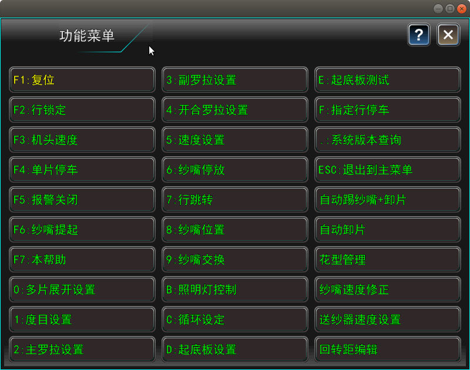

# F7帮助

### 供客户随时查看系统显示操作屏按键的帮助说明

在运行监控画面点击该键弹出\[功能菜单\]，退出请点击右上角\[×\]退回至\[进入编织\]界面，或者点击\[ESC：退出到主菜单\]退至主界面。

### 0：多篇展开设置

**一片多织功能**

### 1：度目设置

### 2：主罗拉设置

**机头编织时主罗拉向下牵拉织物的指令（拉力）**

**触摸操作：**触笔点击**\[2：主罗拉设置\]**图标，显示为黄色字体，弹出\[主罗拉编辑\]界面，界面内显示停车力矩、所有段号罗拉及对应数值，白色字体为当前使用的罗拉段号，灰色字体为未使用罗拉段号。触笔双击蓝色参数框弹出小键盘，输入设定参数数值点击\[确定\]输入，点击\[退出\]退出当前操作。所有参数设定完成后可点击右上角\[×\]或左下角\[退出\]退回至\[进入编织\]界面。

**触摸操作：**其它段与设置段参数相等时，点击左下角\[复制\]弹出提示框：**参数复制**，点击\[确认\]实现全部段复制，即将所有段号罗拉均设定为当前输入值；点击\[取消\]取消当前操作。

设定段数：32段（\#XX为工艺段号）   
数值范围：0－100   
停车力矩：设定机头停止运行时，牵拉自动停止并保持的拉力（力矩电机）。   
取值范围：0－100

**注意：**应按编织结构和编织宽度设置卷布拉力数据。设定数值大小与拉力成正比关系，数值越大，卷动越快，拉力越大。

### 3：副罗拉设置

**机头编织时副罗拉向下牵拉织物的指令（拉力）**

**触摸操作：**触笔点击**\[3：副罗拉设置\]**图标，显示为黄色字体，弹出\[副罗拉编辑\]界面。第一页为\[副罗拉运行速度对照表\]，第二页为\[副罗拉瞬时速度对照表\]，可通过右下角的\[上页\]、\[下页\]进行翻页。界面内显示停车力矩、所有段号罗拉及对应数值，白色字体为当前使用的罗拉段号，灰色字体为未使用罗拉段号。双击蓝色参数框弹出小键盘，输入设定参数数值点击\[确定\]输入，点击\[退出\]退出当前操作。所有参数设定完成后可点击右上角\[×\]或左下角\[退出\]退回至\[进入编织\]界面。

**触摸操作：**其它段与设置段参数相等时，点击左下角\[复制\]弹出提示框：**参数复制**，点击\[确认\]实现全部段复制，即将所有段号罗拉均设定为当前输入值；点击\[取消\]取消当前操作。

设定段数：32段（\#XX为工艺段号）   
数值范围：0－100   
停车力矩：设定机头停止运行时，牵拉自动停止并保持的拉力（力矩电机）。   
取值范围：0－100

**说明：**应按编织结构和编织宽度设置卷布拉力数据。设定数值大小与拉力成正比关系，数值越大，卷动越快，拉力越大。

### 4：开合罗拉设置

**设定机头编织时的开合罗拉**

**触摸操作：**触笔点击**\[4：开合罗拉设置\]**图标，显示为黄色字体，弹出\[开合罗拉编辑\]界面，界面内显示停车力矩、所有段号罗拉及对应数值，白色字体为当前使用的罗拉段号，灰色字体为未使用罗拉段号。触笔双击蓝色参数框弹出小键盘，输入设定参数数值点击\[确定\]输入，点击\[退出\]退出当前操作。所有参数设定完成后可点击右上角\[×\]或左下角\[退出\]退回至\[进入编织\]界面。

**触摸操作：**其它段与设置段参数相等时，点击左下角\[复制\]弹出提示框：**参数复制**，点击\[确认\]实现全部段复制，即将所有段号罗拉均设定为当前输入值；点击\[取消\]取消当前操作。

设定段数：32段（\#XX为工艺段号）   
数值范围：0－100   
停车力矩：设定机头停止运行时，牵拉自动停止并保持的拉力（力矩电机）。   
取值范围：0－100

**说明：**

**步进主罗拉：**  
设定数值大小与罗拉打开成正比关系，数值越大，打开越大。 

**力矩开合罗拉：**  
设定数值大小与罗拉打开成反比关系，数值越大，打开越小。

### 5：速度设置

**用于控制机头编织的移动速度设置**

**触摸操作：**触笔点击**\[5：速度设置\]**图标，显示为黄色字体，弹出\[机头速度编辑\]界面，界面内显示所有速度段数及对应数值，白色字体为当前使用的速度段数，灰色字体为未使用速度段数。触笔双击蓝色参数框弹出小键盘，输入设定参数数值点击\[确定\]输入，点击\[退出\]退出当前操作。所有参数设定完成后可点击右上角\[×\]或左下角\[退出\]退回至\[进入编织\]界面。

**触摸操作：**其它段与设置段参数相等时，点击左下角\[复制\]弹出提示框：**参数复制**，点击\[确认\]实现全部段复制，即将所有段号速度均设定为当前输入值；点击\[取消\]取消当前操作。

设定段数：32段   
数值范围：0－100 

**说明：**设定数值大小与编织速度成正比关系，数值越大，编织越快。

**有如下指令的行保持低速**

1.执行起始操作的第一 行和有结束指令的行   
2.自动停机后使用拉杆再次启动时的第一行

### 6：纱嘴停放

**用于编辑纱嘴的停放位置**

**触摸操作：**触笔点击**\[6：纱嘴停放\]**图标，显示为黄色字体，弹出\[纱嘴停放点编辑\]界面，

### 7：行跳转

**设定机头跳行编制功能**

**触摸操作：**触笔点击**\[7：行跳转\]**图标，显示为黄色字体，弹出提示框：**请输入跳转行号：**，并弹出小键盘，从小键盘输入需要跳转的行数，点击\[确定\]输入行数并跳转，同时退回至\[进入编织\]界面；点击\[退出\]取消当前操作并退回至\[进入编织\]界面。

### 8：纱嘴位置

**设定纱嘴交换和叠纱功能**

**触摸操作：**触笔点击**\[8：纱嘴位置\]**图标，显示为黄色字体，弹出\[纱嘴编辑界面\]，界面显示纱嘴初始位置和纱嘴交换位置，白色字体为当前运行花型中使用到的纱嘴编号，灰色字体为未使用编号纱嘴。触笔双击蓝色参数框弹出小键盘，通过小键盘输入需要交换的纱嘴编号，点击\[确定\]交换纱嘴，点击\[退出\]退出当前操作。修改完成后点击右上角\[×\]或者左下角\[退出\]回到\[进入编织\]界面。

**宽纱嘴：**触笔点击页面左下角\[宽纱嘴\]，可设置机头工作时同时携带两把纱嘴，用于编制特定花型时使用。

**说明：**纱嘴交换不会修改动作文件中的纱嘴，当该花样输出至U盘时，交换信息不会带出。

### 9：纱嘴交换

**设定纱嘴交换和叠纱功能  
（同\[8：纱嘴位置\]弹出界面和功能操作相同）**

### B：照明灯控制

**仅显示功能图标，需退回至\[进入编织\]界面进行照明灯控制操作**

### C：循环设定

**设定编织时的数据循环（节约）**

**触摸操作：**触笔点击**\[C：循环设定\]**图标，显示为黄色字体，弹出\[循环设定\]界面，触笔双击蓝色参数框弹出小键盘，通过小键盘输入\[开始行、结束行、循环数\]的设定数值，点击\[确定\]输入新参数，点击\[退出\]退出当前操作。修改完成后点击右上角\[×\]或左下角\[退出\]回到\[进入编织\]界面。点击右下角\[删除\]可删除当前选定组的循环设定。

设定段数：10（段：\#01 - \#10）   
数值范围：\[开始行\]和\[结束行\]由当前花型总行数决定  
                    \[循环数\]为1-9999

**说明：**

1.必须按序号添加循环组，删除时可自由选定已设定循环组删除  
2.\[开始行\]和\[结束行\]的间隔必须为奇数  
3.本系统支持大、小循环嵌套，但小循环必须在大循环之中

### D：起底板设置

**显示起底板和剪刀夹子的相关参数设置界面**

**触摸操作：**触笔点击**\[D：起底板设置\]**图标，显示为黄色字体，弹出\[起底板/剪刀夹子设置\]界面，界面显示参数名称和数值大小，触笔双击蓝色参数框弹出小键盘，通过小键盘输入需要设定的参数大小，点击\[确定\]输入新参数，点击\[退出\]退出当前操作。通过右下角的\[上页\]、\[下页\]可进行翻页操作。修改完成后点击右上角\[×\]回到\[进入编织\]界面。

### E：起底板测试

**触摸操作：**触笔点击**\[E：起底板测试\]**图标，显示为黄色字体，弹出\[起底板测试\]界面，详见说明书的\[机器测试\]章节第三部分。

### F：指定行停车

**设置指定行停车**

**触摸操作：**触笔点击**\[F：指定行停车\]**图标，显示为黄色字体，弹出\[指定行停车\]提示框，双击\[行号\]纵列下的蓝色参数框弹出小键盘，从小键盘输入需要停车的行数，点击\[确定\]输入行数，点击\[退出\]取消当前操作。该界面可一次设置多个停车行，设定完成后点击右上角\[×\]回到\[进入编织\]界面。

**说明：**

机头运转过程中，在停车设定行的前两行回转位置停车，即比设定的停车指定行提前两行停车。

当机头因此指令而停止时，屏幕会弹出提示框：**指定行停车**，同时报警，点击提示框右上角\[×\]或拉杆反转至停止位可取消并解除警报。

### .：系统版本查询

**触摸操作：**触笔点击**\[.：系统版本查询\]**图标，显示为黄色字体，弹出**\[系统版本信息\]**提示框，点击右上角\[×\]回到\[进入编织\]界面。

### ESC：退出到主菜单

**触摸操作：**触笔点击**\[ESC：退出到主菜单\]**图标，显示为黄色字体，返回至主菜单界面

### 自动踢纱嘴+卸片

**触摸操作：**触笔点击**\[自动踢纱嘴+卸片\]**图标，显示为黄色字体，弹出提示框：**是否进行自动卸片？**，点击\[确认弹出提示框：**拉杆启动自动卸片**，手动启动拉杆后机头自动归零并卸片；点击\[取消\]取消操作。

### 自动卸片

**触摸操作：**触笔点击**\[自动卸片\]**图标，显示为黄色字体，弹出提示框：**是否进行自动卸片？**，点击\[确认\]进行卸片，点击\[取消\]取消操作，完成后返回至\[进入编织\]界面。

### 花型管理

**触摸操作：**触笔点击**\[花型管理\]**图标，显示为黄色字体，弹出\[花型管理\]提示框，见说明书的\[花型管理\]章节。

### 纱嘴速度修正

### 送纱器速度设置

**设定力矩电机辅助送纱速度（电机转速）**

**触摸操作：**触笔点击**\[送纱器速度设置\]**图标，显示为黄色字体，弹出\[送纱器速度设置\]界面，界面内显示所有速度段数和对应数值，以及左右送纱装置的开关状态。触笔点击蓝框可选择左右送纱装置的开关，双击速度段数对应的蓝色参数框会弹出小键盘，输入设定参数数值点击\[确定\]输入，点击\[退出\]退出当前操作。所有参数设定完成后可点击右上角\[×\]或左下角\[退出\]退回至\[进入编织\]界面。

**触摸操作：**其它段与设置段参数相等时，点击左下角\[复制\]可实现全部段复制，即将所有段号速度均设定为当前输入值。

### 回转距编辑

**仅显示功能图标，需退回至主界面再进入\[工作参数\]界面设置**

