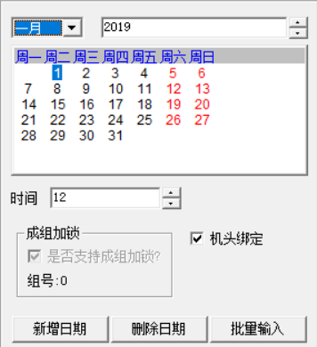

# 分期加密

### **一、加锁工具部分**

1. 生成加锁文件时机头绑定选项需要打勾。
2. 加锁工具版本需要在0.0.1.2版本以上。
3. 支持序列号加密模式。
4. 使用序列号生产加密文件时，机头绑定选项也需要打勾。
5. 在生成解密文件时，需要同时加锁下一期，机头主控会自动绑定。
6. 输入带有机头绑定加锁文件时，主控机头会自动绑定加锁。
 

### **二、**软件升级部分

1. 主控机头版本需要更新最新版本（具体版本可咨询恒强技术人员）。
2. 机头版本单系统版本号显示1BXX 。
3. 机头版本双系统版本号显示 1DXX , 2DXX 。
4. 版本查询，机头加锁绑定成功机头版号本显示为红色字体。

### 

**三、**参数设置部分

1. 系统参数增加机头绑定选项。

* [x] 未绑定过的机头主板，需要和已加锁主控绑定，可以在系统参数机头绑定选项
* [x] 点击输入密码 ：1 6 1 8 填入数字“ 1 确定后系统会提示绑定成功。

    2. 系统参数输出打开MCH格式文件，可以查看版本信息以及加锁绑定信息。

### **四、注意事项**

1. 不同序列号加锁文件加密后，机头主板不能调换使用。
2. 主控有加锁，需更换未绑定过机头主板，需要重新绑定（不绑定30分钟之后会报警提示）。
3. 加锁日期最后一期解锁或全解时，输入解锁文件主控和机头自动解除绑定。
4. 机头主板有被绑定过不确定是否有解除绑定，在厂家维护进去查看有绑定会提示机头锁定。
5. 机头主板又版本。
6. 因主控问题不能正常解密，需要更换新主控需使用原来加锁文件或生成和原文件序列号一样 的加锁文件加锁，才能和机头重新绑定无需解密。
7. 加锁方式，建议使用序列号模式加锁。
8. 机头可以单独查看绑定序列号。
9. DSP版本需要3010可以支持。

